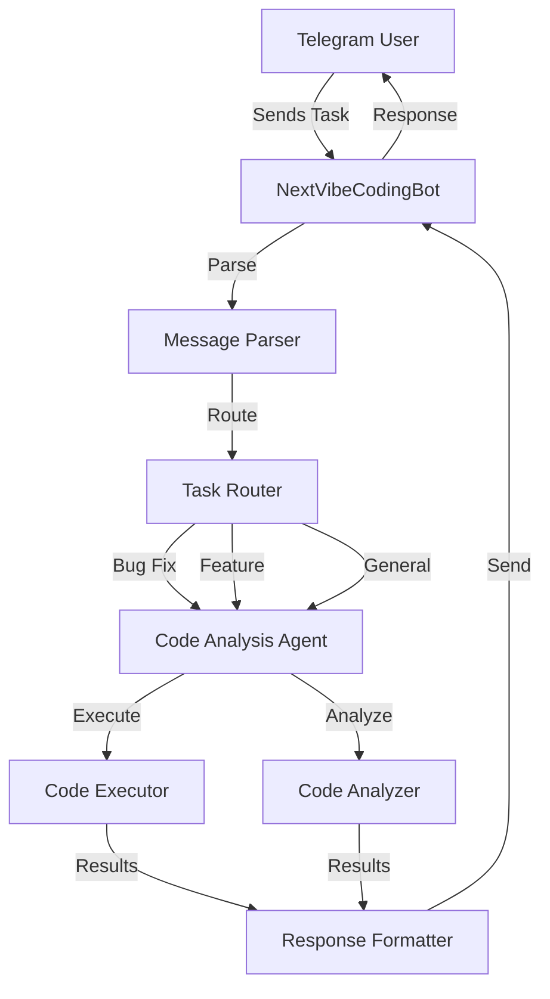

# NextVibeCodingBot Architecture

## System Overview

## Key Components
- **Bot Handler**: Telegram bot wrapper using python-telegram-bot
- **Message Parser**: Parse and classify incoming coding tasks
- **Task Router**: Route tasks to appropriate processing pipeline
- **Code Analysis Agent**: AI-powered code understanding and generation
- **Code Executor**: Safe code execution environment
- **Response Formatter**: Format results for Telegram delivery

## Technology Stack
- Python 3.8+
- python-telegram-bot for Telegram integration
- OpenAI/Anthropic API for coding intelligence
- Docker for safe code execution
- SQLite for task logging and history